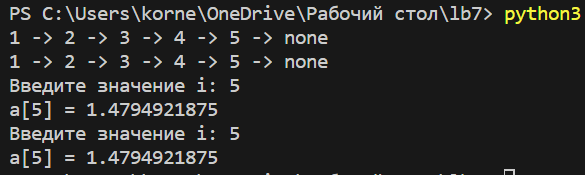

# Лабораторная работа №7.
## Рекурсия
### Задание
Напишите две функции для решения задач своего варианта - с использованием рекурсии и без.
Функция для преобразования вложенных списков в строку:
```python
to_str([1, [2, [3, [4, [5]]]]])
'1 -> 2 -> 3 -> 4 -> 5 -> None'
```
Функция для расчёта 
$a_i = a_{i-2} + \frac{a_{i-1}}{2^{i-1}} \cdot a_0 = a_1 = 1$

```python
#Функция для преобразования вложенных списков в строку без использования рекурсии:

def to_str(lst):
    stack = []
    result = []

    while lst or stack:
        if lst:
            if isinstance(lst, list):
                stack.append(lst)
                lst = lst[0]
            else:
                result.append(str(lst))
                lst = None
        else:
            lst = stack.pop()
            result.append('->')
            if len(lst) > 1:
                stack.append(lst[1])
                lst = lst[1][0]
            else:
                lst = None

    result.append('none')
    return ' '.join(result)


#Пример использования:

lst = [1, [2, [3, [4, [5]]]]]
print(to_str(lst))


#Вывод: 1 -> 2 -> 3 -> 4 -> 5 -> none

#Функция для преобразования вложенных списков в строку с использованием рекурсии:

def to_str_recursive(lst):
    if isinstance(lst, list):
        if len(lst) > 1:
            return str(lst[0]) + ' -> ' + to_str_recursive(lst[1])
        else:
            return str(lst[0]) + ' -> none'
    else:
        return str(lst)


#Пример использования:

lst = [1, [2, [3, [4, [5]]]]]
print(to_str_recursive(lst))


#Вывод: 1 -> 2 -> 3 -> 4 -> 5 -> none

#Функция для расчета a[i] = a[i-2] + ((a[i-1])/(2^(i-1))) без использования рекурсии:

def calculate_a(i):
    if i == 0 or i == 1:
        return 1
    
    a = [1, 1]

    for k in range(2, i+1):
        a_k = a[k-2] + ((a[k-1])/(2**(k-1)))
        a.append(a_k)

    return a[i]


#Пример использования:

i = int(input("Введите значение i: "))
result = calculate_a(i)
print(f"a[{i}] = {result}")


#Функция для расчета a[i] = a[i-2] + ((a[i-1])/(2^(i-1))) с использованием рекурсии:

def calculate_a_recursive(i):
    if i == 0 or i == 1:
        return 1
    else:
        return calculate_a_recursive(i-2) + (calculate_a_recursive(i-1)/(2**(i-1)))


#Пример использования:

i = int(input("Введите значение i: "))
result = calculate_a_recursive(i)
print(f"a[{i}] = {result}")
```
### Вывод программы.
